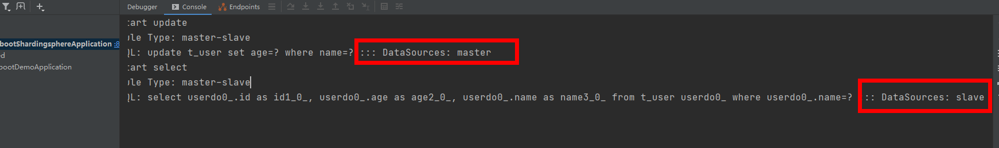

### SpringBoot2.4.3 + JPA + Hikari + ShardingSphere实现读写分离

### 1.数据库表结构
```mysql
CREATE TABLE `t_user`  (
  `id` int(11) NOT NULL AUTO_INCREMENT,
  `name` varchar(255) CHARACTER SET utf8 COLLATE utf8_general_ci NULL DEFAULT NULL,
  `age` int(11) NULL DEFAULT NULL,
  PRIMARY KEY (`id`) USING BTREE
) ENGINE = InnoDB AUTO_INCREMENT = 4 CHARACTER SET = utf8 COLLATE = utf8_general_ci ROW_FORMAT = Compact;
```

### 2. 主要代码

#### 2.1.配置文件设置
```properties
sharding.jdbc.datasource.names=master,slave
# master主库设置
sharding.jdbc.datasource.master.type=com.zaxxer.hikari.HikariDataSource
sharding.jdbc.datasource.master.driver-class-name=com.mysql.cj.jdbc.Driver
sharding.jdbc.datasource.master.jdbc-url=jdbc:mysql://ip:port/database
sharding.jdbc.datasource.master.username=
sharding.jdbc.datasource.master.password=
# Slave从库设置
sharding.jdbc.datasource.slave.type=com.zaxxer.hikari.HikariDataSource
sharding.jdbc.datasource.slave.driver-class-name=com.mysql.cj.jdbc.Driver
sharding.jdbc.datasource.slave.jdbc-url=jdbc:mysql://ip:port/database
sharding.jdbc.datasource.slave.username=
sharding.jdbc.datasource.slave.password=
# 配置读写分离
sharding.jdbc.config.masterslave.name=ms
sharding.jdbc.config.masterslave.master-data-source-name=master
sharding.jdbc.config.masterslave.slave-data-source-names=slave
# 打印SQL，测试时可以看到SQL查询使用的DataSource
sharding.jdbc.config.props.sql.show=true
```

#### 2.2.实体类
```Java
@Entity
@Data
@Table(name = "t_user")
public class UserDO {

    @Id
    @GeneratedValue(strategy = GenerationType.IDENTITY)
    Integer id;

    String name;

    Integer age;
    
    public UserDO() {
    }

    public UserDO(String name, Integer age) {
        this.name = name;
        this.age = age;
    }
}
```

#### 2.3.Repo配置
```java
@Repository
public interface UserRepo extends JpaRepository<UserDO, Integer> {

    @Transactional
    @Modifying
    @Query(value = "update UserDO set age = :age where name = :name")
    void updateAge(@Param("name") String name, @Param("age") Integer age);

    UserDO findByName(String name);

}
```

到此就配置完了，可以使用起来了。我写了一个service+controller方便测试，代码如下：

#### 2.4.Service
```java
@Service
public class UserService {

    @Autowired
    UserRepo userRepo;

    public void testUpdate(String name, Integer age) {
        userRepo.updateAge(name, age);
    }

    public Integer testSelect(String name) {
        return userRepo.findByName(name).getAge();
    }

}
```

#### 2.5.Controller
```java
@RestController
@Slf4j
public class TestController {

    @Autowired
    UserService userService;

    @GetMapping("/test")
    public Integer testInsert() {
        log.info("start update");
        userService.testUpdate("zhangsan", (int) (Math.random() * 100));
        log.info("start select");
        return userService.testSelect("zhangsan");
    }

}
```

### 3.测试
controller中会先进行写操作(修改年龄)，然后进行读操作(读取修改后的年龄)

访问`http://127.0.0.1:8080/test` 后查看日志如下：



可以看到update操作落在了master数据源上，select操作落在slave数据源上。